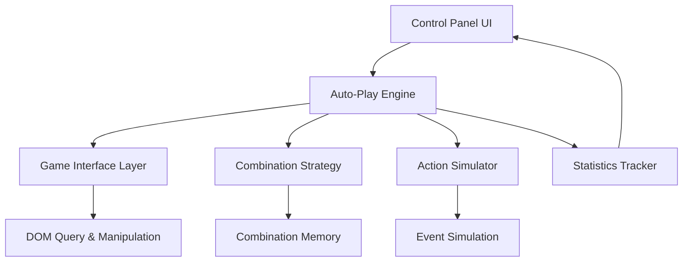
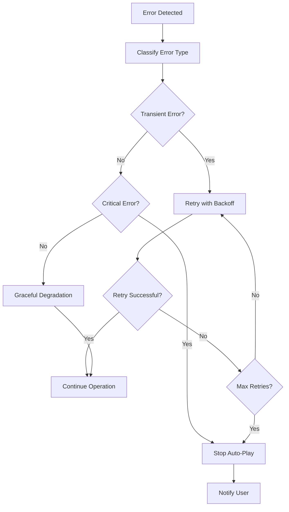

# Design Document

## Overview

The auto-play engine is designed as a modular system that integrates with the existing Infinite Craft Helper userscript. The engine simulates human-like interactions with the game interface through DOM manipulation and event simulation, providing autonomous element combination exploration while maintaining the ability to start, stop, and monitor progress.

The design follows a layered architecture with clear separation between game interface detection, action simulation, combination strategy, and user interface components. This approach ensures maintainability, testability, and extensibility while adhering to the incremental development methodology.

## Architecture

### High-Level Architecture



### Component Layers

1. **Control Panel Integration**: Extends existing UI with auto-play controls
2. **Auto-Play Engine Core**: Orchestrates the automation process
3. **Game Interface Layer**: Handles game-specific DOM queries and element detection
4. **Action Simulator**: Simulates realistic mouse interactions and drag operations
5. **Combination Strategy**: Manages intelligent element selection and combination logic
6. **Statistics Tracker**: Monitors progress and maintains session data

## Components and Interfaces

### AutoPlayEngine (Core Orchestrator)

```javascript
class AutoPlayEngine {
    constructor(gameInterface, actionSimulator, strategy, statsTracker)
    
    // Core control methods
    start()
    stop()
    pause()
    resume()
    
    // State management
    getStatus()
    isRunning()
    
    // Main execution loop
    async runCycle()
}
```

**Responsibilities:**
- Orchestrates the overall auto-play process
- Manages engine state (stopped, running, paused, error)
- Coordinates between different components
- Handles error recovery and graceful shutdown

### GameInterface (DOM Interaction Layer)

```javascript
class GameInterface {
    // Element detection
    getAvailableElements()
    getPlayAreaElements()
    getElementCount()
    
    // Element queries
    findElementByName(name)
    findElementsByType(type)
    isElementDraggable(element)
    
    // Game state detection
    isGameReady()
    isLoading()
    detectNewElements()
    
    // Utility methods
    getElementBounds(element)
    isPlayAreaFull()
}
```

**Responsibilities:**
- Abstracts game-specific DOM structure
- Provides reliable element detection and querying
- Monitors game state changes
- Handles dynamic content loading

### ActionSimulator (Interaction Simulation)

```javascript
class ActionSimulator {
    // Basic interactions
    async clickElement(element)
    async dragElement(fromElement, toElement)
    async dragToPosition(element, x, y)
    
    // Realistic behavior simulation
    generateMousePath(start, end)
    addHumanDelay()
    simulateMouseEvents(element, eventType)
    
    // Drag operation management
    async startDrag(element)
    async continueDrag(x, y)
    async endDrag()
}
```

**Responsibilities:**
- Simulates realistic mouse movements and timing
- Generates human-like interaction patterns
- Handles complex drag-and-drop operations
- Provides consistent event simulation

### CombinationStrategy (Intelligence Layer)

```javascript
class CombinationStrategy {
    // Combination selection
    selectNextCombination()
    prioritizeUntested()
    avoidFailedCombinations()
    
    // Memory management
    recordCombination(element1, element2, result)
    markCombinationFailed(element1, element2)
    hasBeenTested(element1, element2)
    
    // Strategy optimization
    updateStrategy(discoveryRate)
    getRecommendedElements()
}
```

**Responsibilities:**
- Implements intelligent combination selection algorithms
- Maintains memory of attempted combinations
- Optimizes discovery efficiency
- Adapts strategy based on success patterns

### StatisticsTracker (Monitoring Component)

```javascript
class StatisticsTracker {
    // Session tracking
    startSession()
    endSession()
    recordAttempt(element1, element2)
    recordDiscovery(newElement)
    
    // Statistics calculation
    getAttemptCount()
    getDiscoveryCount()
    getSuccessRate()
    getSessionDuration()
    
    // Real-time updates
    updateUI()
    exportSessionData()
}
```

**Responsibilities:**
- Tracks session statistics and performance metrics
- Provides real-time UI updates
- Maintains historical data
- Supports data export and analysis

## Data Models

### Element Model
```javascript
{
    name: string,           // Element display name
    domElement: HTMLElement, // Reference to DOM element
    position: {x, y},       // Current position
    isNew: boolean,         // Recently discovered flag
    discoveredAt: Date      // Discovery timestamp
}
```

### Combination Record
```javascript
{
    element1: string,       // First element name
    element2: string,       // Second element name
    result: string|null,    // Result element name or null if failed
    timestamp: Date,        // When combination was attempted
    success: boolean        // Whether combination succeeded
}
```

### Session Statistics
```javascript
{
    startTime: Date,
    endTime: Date,
    totalAttempts: number,
    successfulCombinations: number,
    newElementsDiscovered: number,
    uniqueElementsUsed: number,
    averageTimePerAttempt: number
}
```

## Error Handling

### Error Categories

1. **Game Interface Errors**: DOM elements not found, game state changes
2. **Interaction Errors**: Failed drag operations, unresponsive elements
3. **Strategy Errors**: No valid combinations available, infinite loops
4. **System Errors**: Memory issues, performance degradation

### Error Recovery Strategies

- **Retry Logic**: Automatic retry with exponential backoff for transient errors
- **Graceful Degradation**: Fall back to simpler strategies when advanced features fail
- **User Notification**: Clear error messages with suggested actions
- **Automatic Stop**: Halt automation when critical errors occur

### Error Handling Flow



## Testing Strategy

### Unit Testing Approach

1. **Component Isolation**: Test each component independently with mocked dependencies
2. **DOM Simulation**: Use JSDOM or similar for testing DOM interactions
3. **Event Simulation**: Mock browser events for interaction testing
4. **Strategy Validation**: Test combination algorithms with known element sets

### Integration Testing

1. **Component Integration**: Test interactions between major components
2. **Game Interface Testing**: Validate DOM queries against actual game structure
3. **End-to-End Scenarios**: Test complete auto-play cycles with controlled conditions

### Manual Testing Protocol

1. **Basic Actions**: Verify element counting, selection, and dragging individually
2. **Combination Testing**: Test single combinations with known results
3. **Session Testing**: Run short auto-play sessions with monitoring
4. **Error Scenarios**: Test error handling with simulated failures
5. **Performance Testing**: Monitor resource usage during extended sessions

### Testing Phases

**Phase 1: Foundation Testing**
- Element detection and counting
- Basic DOM queries and manipulation
- Simple event simulation

**Phase 2: Action Testing**
- Drag and drop operations
- Mouse movement simulation
- Timing and delay validation

**Phase 3: Strategy Testing**
- Combination selection algorithms
- Memory and learning systems
- Performance optimization

**Phase 4: Integration Testing**
- Full auto-play cycles
- Error handling and recovery
- UI integration and updates

**Phase 5: User Acceptance Testing**
- Real-world usage scenarios
- Performance under various conditions
- User interface usability