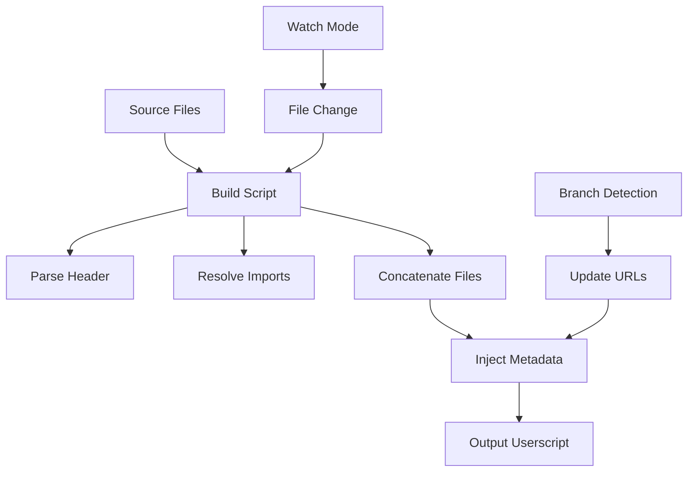

# Design Document

## Overview

The multi-file build system will transform the current 1179-line userscript into a modular development structure while maintaining the single-file distribution model. The system will use Node.js-based tooling to concatenate ES6 modules into a complete userscript, preserving all functionality while improving maintainability.

## Architecture

### Source File Organization

```
src/
├── header.js                 # Userscript metadata and configuration
├── core/
│   ├── version.js           # Version management utilities
│   ├── logger.js            # LogManager and Logger API
│   └── game-interface.js    # Game interaction utilities
├── ui/
│   ├── control-panel.js     # Main control panel creation
│   ├── styles.js            # CSS styles injection
│   └── draggable.js         # Drag functionality
├── utils/
│   └── dom.js               # DOM utilities and helpers
└── main.js                  # Entry point and initialization
```

### Build Process Flow



### Quality Gate Execution

Before resolving modules, the build manager now executes configured quality checks. These commands are defined in `build.config.js` and typically include linting (`npm run lint`) and unit tests (`npm test`). Each command streams output directly to the console and fails the build on non-zero exit codes. Quality checks can be configured to skip during watch mode when necessary.

### Linting Strategy (ESLint Adoption Plan)

- **Tooling**: Add `eslint`, `@eslint/js`, and `globals` as dev dependencies with an `eslint.config.js` flat configuration. Extend the recommended ruleset and layer in project conventions (4-space indent, single quotes, semi-colons, no tabs, no trailing whitespace).
- **Environment Targets**: Enable both `browser` and `node` environments; add `globals` for userscript/Tampermonkey objects and Playwright test globals.
- **Ignore Patterns**: Exclude `dist/`, `node_modules/`, `.kiro/`, generated reports, and the compiled userscript. Keep `src/`, `build/`, `tests/`, `scripts/` within scope.
- **Custom Rules**: Mirror existing formatting checks (`no-trailing-spaces`, `no-tabs`) and add sustainable defaults (`eqeqeq`, `no-unused-vars` with allow patterns for underscores).
- **Quality Gate Integration**: Update `build.config.js` quality commands to run `npm run lint`, which now delegates to ESLint; keep the legacy whitespace script exposed via `npm run lint:format` for quick checks.
- **Follow-up Tests**: Add lint-focused fixtures or sample files in tests to ensure lint command fails on expected violations, aligning with the new Quality Gate Policy.

## Components and Interfaces

### Build System Core

**BuildManager Class**
- Orchestrates the entire build process
- Handles file watching and incremental builds
- Manages branch-specific configuration

```javascript
class BuildManager {
    constructor(config) {
        this.config = config;
        this.watcher = null;
    }
    
    async build() { /* Build logic */ }
    async watch() { /* Watch mode logic */ }
    async clean() { /* Cleanup logic */ }
}
```

**ModuleResolver**
- Parses ES6 import/export statements
- Resolves dependency order
- Handles circular dependency detection

```javascript
class ModuleResolver {
    constructor(srcDir) {
        this.srcDir = srcDir;
        this.dependencyGraph = new Map();
    }
    
    async resolveModules() { /* Resolution logic */ }
    getExecutionOrder() { /* Dependency sorting */ }
}
```

### Source File Structure

**Header Template (src/header.js)**
```javascript
export const metadata = {
    name: 'Infinite Craft Helper',
    namespace: 'http://tampermonkey.net/',
    version: '{{VERSION}}',
    description: 'Control panel overlay for Infinite Craft with GameInterface foundation',
    author: 'You',
    match: [
        'https://neal.fun/infinite-craft/*',
        'https://neal.fun/infinite-craft'
    ],
    updateURL: '{{UPDATE_URL}}',
    downloadURL: '{{DOWNLOAD_URL}}',
    supportURL: 'https://github.com/bytecodeguru/infinite-crafter/issues',
    homepageURL: 'https://github.com/bytecodeguru/infinite-crafter',
    grant: 'none'
};
```

**Module Exports Pattern**
```javascript
// src/core/version.js
export function getVersionInfo() {
    // Version logic
}

// src/ui/control-panel.js
import { getVersionInfo } from '../core/version.js';

export function createControlPanel() {
    // Panel creation logic
}
```

### Configuration System

**build.config.js**
```javascript
export default {
    srcDir: './src',
    outputDir: './dist',
    outputFile: 'infinite-craft-helper.user.js',
    watch: {
        enabled: false,
        debounce: 300
    },
    branch: {
        auto: true,
        urlTemplate: 'https://raw.githubusercontent.com/bytecodeguru/infinite-crafter/{{BRANCH}}/infinite-craft-helper.user.js'
    }
};
```

## Data Models

### Build Context
```javascript
interface BuildContext {
    branch: string;
    version: string;
    isDev: boolean;
    timestamp: Date;
    sourceFiles: string[];
    outputPath: string;
}
```

### Module Definition
```javascript
interface ModuleDefinition {
    path: string;
    exports: string[];
    imports: ImportDefinition[];
    content: string;
    dependencies: string[];
}
```

### Import Definition
```javascript
interface ImportDefinition {
    specifiers: string[];
    source: string;
    isDefault: boolean;
}
```

## Error Handling

### Build Errors
- **Syntax Errors**: Catch and report with file location
- **Import Errors**: Validate all imports resolve to existing exports
- **Circular Dependencies**: Detect and report circular imports
- **File System Errors**: Handle missing files and permission issues

### Runtime Error Prevention
- Preserve original error handling from single-file version
- Add build-time validation for common userscript issues
- Validate userscript metadata format

### Error Reporting
```javascript
class BuildError extends Error {
    constructor(message, file, line, column) {
        super(message);
        this.file = file;
        this.line = line;
        this.column = column;
    }
}
```

## Testing Strategy

### Build System Tests
- **Unit Tests**: Test individual build components (ModuleResolver, BuildManager)
- **Integration Tests**: Test complete build process with sample source files
- **File System Tests**: Test file watching and incremental builds

### Output Validation
- **Syntax Validation**: Ensure generated userscript is valid JavaScript
- **Functionality Tests**: Compare behavior of built userscript vs original
- **Metadata Tests**: Validate userscript header format and content

### Development Workflow Tests
- **Branch Integration**: Test branch-specific URL generation
- **Watch Mode**: Test file change detection and rebuild triggers
- **Error Scenarios**: Test handling of various error conditions

### Test Structure
```
test/
├── unit/
│   ├── build-manager.test.js
│   ├── module-resolver.test.js
│   └── config.test.js
├── integration/
│   ├── build-process.test.js
│   └── watch-mode.test.js
├── fixtures/
│   └── sample-src/
└── output/
    └── generated-tests/
```

## File Size and Focus Policy

### Global File Size Guidelines
- **Maximum file size**: 300 lines per source file
- **Recommended size**: 150-200 lines per file
- **Single responsibility**: Each file should have one clear purpose
- **Function limits**: Maximum 50 lines per function, 30 lines recommended

### Enforcement Strategy
- **Build-time validation**: Build system checks file sizes and warns if exceeded
- **Linting integration**: ESLint rules to enforce function and file size limits
- **Code review guidelines**: Automated checks in development workflow

### File Organization Principles
- **Feature-based splitting**: Group related functionality together
- **Layer-based separation**: Separate UI, business logic, and utilities
- **Dependency minimization**: Reduce cross-file dependencies where possible
- **Clear interfaces**: Well-defined exports and imports between modules

### Size Violation Handling
```javascript
// Build system validation
if (fileLines > 300) {
    console.warn(`File ${filePath} exceeds 300 lines (${fileLines}). Consider splitting.`);
}

if (functionLines > 50) {
    console.warn(`Function ${functionName} exceeds 50 lines. Consider refactoring.`);
}
```

## Implementation Phases

### Phase 1: Basic Build System
- Create build script that concatenates files
- Implement basic module resolution
- Generate working userscript from split files
- Add file size validation and warnings

### Phase 2: Development Tools
- Add watch mode for automatic rebuilds
- Implement branch-aware URL generation
- Add error handling and reporting
- Integrate file size policy enforcement

### Phase 3: Advanced Features
- Add source maps for debugging
- Implement incremental builds
- Add build optimization options
- Add automated file splitting suggestions

### Phase 4: Integration
- Update existing development workflow
- Create migration guide for existing code
- Add automated testing for build process
- Document file organization best practices